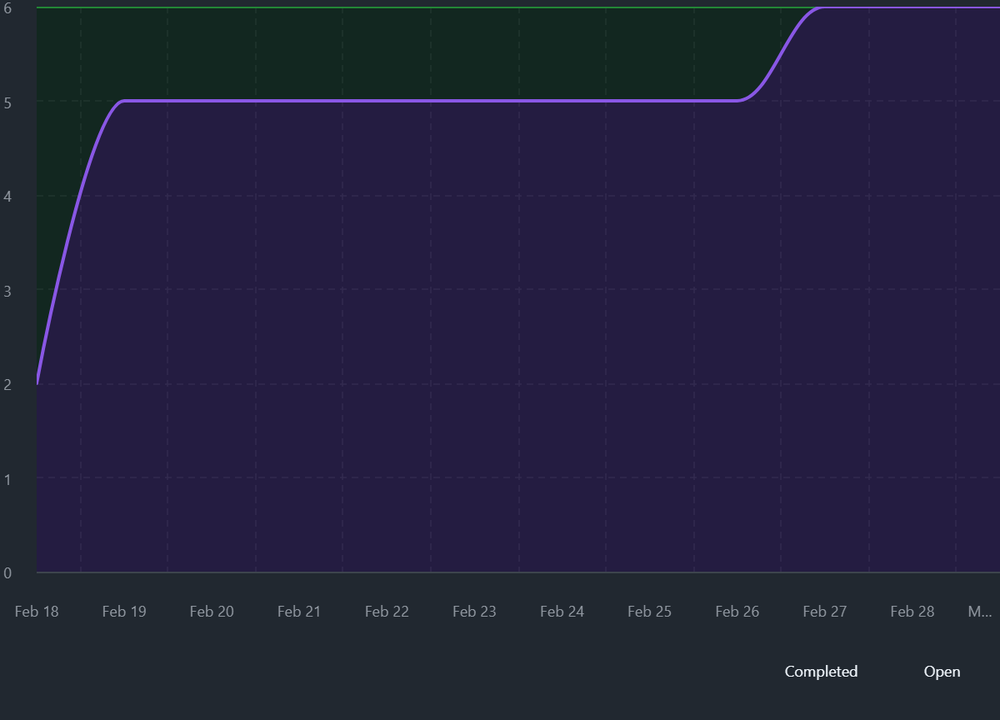

# LoreSmith – Agile Artifacts

## Project Objective

LoreSmith is a lightweight campaign management tool for tabletop RPG Dungeon Masters. The goal is to provide structured management of NPCs, factions, locations, and session logs while maintaining the flexibility required for narrative storytelling.

The system is being developed using Agile Scrum practices in short iterations, allowing functionality to evolve incrementally based on customer feedback and changing needs.

---

## Sprint Cadence

The LoreSmith project follows a two-week sprint cadence.

Planned sprint schedule:

- Sprint 1: Feb 18 – Mar 1
- Sprint 2: Mar 2 – Mar 15
- Sprint 3: Mar 16 – Mar 29
- Sprint 4: Mar 30 – Apr 12
- Sprint 5: Apr 13 – Apr 26
- Final stabilization and documentation: Apr 27 – May 5

Each sprint includes:

- Sprint Planning
- Development work
- Customer demonstration
- Sprint Retrospective

This cadence allows frequent delivery of working software and continuous refinement of the backlog.

---

## Definition of Done (DoD)

A user story is considered **Done** when all of the following criteria are met:

1. Code is implemented and committed to the `main` branch.
2. The application runs without errors.
3. All acceptance criteria for the story are satisfied.
4. Data persists correctly in the hosted database between application restarts.
5. Code has been reviewed by the other developer.
6. The feature is demonstrable during the sprint demo.
7. No known critical defects remain.

Stories may not be moved to **Done** unless all criteria above are satisfied.

---

## User Role Modeling

During initial project envisioning, several potential user roles were considered:

- **Dungeon Master (DM)** – Primary content creator and campaign organizer
- **Player** – Consumer of session summaries and character information
- **Co-Dungeon Master** – Collaborative campaign manager
- **Campaign Viewer (Read-Only)** – Observer with limited interaction

Given the limited scope of a single-semester project, the system currently focuses on the **Dungeon Master role**, as this role derives the most direct value from campaign organization tools.

Other roles may be considered in future iterations if development capacity allows.

---

## Estimation Approach

User stories are estimated using **story points** on the Fibonacci scale:

1, 2, 3, 5, 8, 13

Story points represent **relative effort and uncertainty**, not time.

The baseline story used for estimation anchoring is:

**Create NPC – 3 story points**

Other stories were estimated relative to this baseline, considering:

- UI complexity
- database interactions
- backend logic
- uncertainty in implementation

---

## Prioritization Approach

LoreSmith user stories are prioritized using a **Business Value scale from 1–10**.

Higher values indicate:

- greater importance to the Dungeon Master
- stronger contribution toward the MVP

Qualitatively, prioritization also considered **Kano analysis**.

### Kano Categories

**Mandatory**
- Core CRUD functionality
- Database persistence

**Linear Value**
- Factions
- Session tracking
- Filtering and searching

**Exciters**
- Visualizations
- relationship graphs
- campaign timelines
- map-based world visualization

Mandatory functionality is prioritized first to ensure the application remains usable as early as possible.

---

## Team Velocity

Sprint 1 established the team's initial velocity baseline.

### Sprint 1 Results

Planned scope:  
**18 story points**

Completed scope:  
**18 story points**

In addition to the planned scope, several minor bug fixes were completed after all committed work was finished.

Because the sprint completed successfully with remaining capacity, the team increased the planned capacity for Sprint 2 slightly to **20 story points**.

Velocity will continue to be refined empirically as additional sprints are completed.

---

## Sprint Metrics

### Burn-Up Chart

The following burn-up chart captures progress across Sprint 1.

The burn-up chart shows steady progress toward sprint completion and confirms that the entire planned sprint scope was completed before the sprint review.

Burn-up charts were chosen instead of burn-down charts because they make it easier to visualize both completed work and total scope over time.

---

## Backlog Evolution

The product backlog is continuously refined based on feedback from sprint demonstrations.

During the Sprint 1 demo, the customer suggested several improvements to the application:

- NPC entries should support images
- NPCs should support a system-agnostic stat block
- The application should support **locations** within a campaign
- NPCs and factions should eventually be associated with locations
- Visual map-based display of campaign elements may be valuable

These suggestions resulted in several new user stories being added to the backlog and prioritized for future sprints.

This process reflects the Agile principle of **welcoming changing requirements and adapting the backlog based on user feedback**.

---

## Sprint 2 Commitment

Sprint 2 focuses on expanding NPC capabilities and introducing campaign locations.

Stories committed to Sprint 2:

- Add NPC Stat Block
- Add NPC Image
- Create Location
- View Locations
- Edit Locations
- Delete Location

Total planned effort:  
**20 story points**

This sprint delivers richer NPC information and introduces a new core campaign entity: **Locations**.

These capabilities lay the foundation for future relationship tracking and map visualization features.

---

## Development Workflow

The project uses **GitHub Projects** for backlog management and sprint tracking.

Repository:  
https://github.com/TheSirLancelot/loresmith

Project board:  
https://github.com/users/TheSirLancelot/projects/3

The repository uses a simple branching strategy:

- `main` – stable user-facing application
- `dev` – sprint integration branch
- feature branches for individual stories

Both `main` and `dev` are protected branches requiring pull requests for changes.

This workflow supports collaborative development while maintaining a stable deployable application.