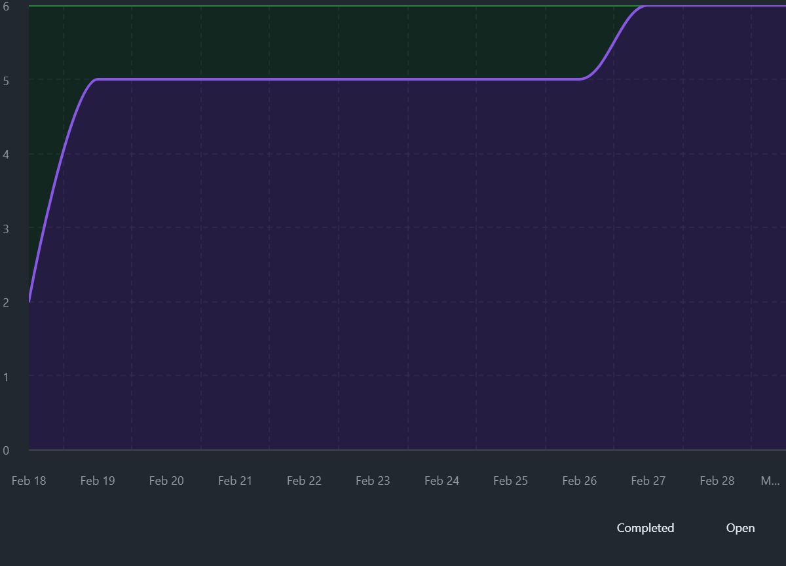
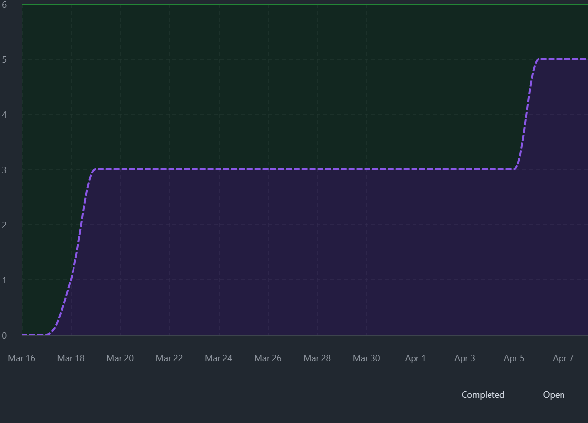

# Course Project Checkup – LoreSmith

## 1. Project Overview

### Project Objective
The objective of LoreSmith is to provide Dungeon Masters with a simple, reliable tool for creating and managing campaign content. The long term goal is to reduce the overhead associated with tracking NPCs, locations, and narrative elements so that Dungeon Masters can focus more on storytelling and gameplay rather than manual note management.

### Project Description
LoreSmith is a web-based application designed to support tabletop roleplaying game preparation and session management. The current implementation focuses on NPC management, providing a centralized system where users can create, view, edit, and delete NPC records with persistent storage in a hosted database.

This initial version represents a vertical slice of the system and validates the core architecture, including backend services, database integration, and end-to-end Create, Read, Update, and Delete (CRUD) functionality. The emphasis for this phase was on establishing a stable foundation rather than building out a full feature set.

Future iterations of LoreSmith are planned to expand beyond NPC management into a more complete campaign management platform. This includes:
- Relationship tracking between NPCs, locations, and factions
- Campaign and session organization tools
- Search and filtering capabilities for large datasets
- Player-facing views for shared campaign information
- Potential integration with virtual tabletop platforms

These planned features build on the current architecture and are intended to incrementally evolve the system into a more comprehensive tool without requiring major rework of the existing foundation.

### System Overview
LoreSmith follows a simple web application architecture consisting of a frontend, backend, and database. The frontend provides the user interface for interacting with campaign data, the backend handles application logic and API requests, and the database is responsible for persistent storage.

The current data model focuses on two core entities: NPCs and locations. These entities form the foundation of the application and support the primary goal of managing campaign information in a structured way.

The system was designed with incremental development in mind. Future iterations are planned to expand the data model to include relationships between entities, such as linking NPCs to factions and locations, as well as additional campaign management features. This approach allows new functionality to be added without requiring significant changes to the existing architecture.

### Team Structure

This project is being developed by a small team consisting of two contributors. I am acting in the role of both project manager and primary developer, responsible for planning, backlog management, and overall project direction in addition to implementation work.

A second contributor is supporting development efforts and is acting as the rest of the development team. This structure allows for collaboration on implementation while still maintaining a single point of coordination for planning and decision making.

### Intended Users
Primary users are Dungeon Masters who need a structured way to manage NPCs and other campaign elements during both preparation and live sessions.

Secondary users may include players who could eventually access limited, shared campaign information, though this is not currently part of the implemented scope.

### Project Artifacts

The project is publicly available and all development activity, including user stories, issues, pull requests, and progress tracking, can be viewed through the following resources:

- GitHub Repository: https://github.com/TheSirLancelot/loresmith  
- Project Board: https://github.com/users/TheSirLancelot/projects/3
- Website: https://loresmith.streamlit.app/  

These artifacts serve as the primary source of truth for the project and provide direct evidence of backlog management, sprint execution, and incremental development progress.

---

## 2. Iteration Summary

### Sprint 0 Overview
Sprint 0 focused on establishing the foundation for development. During this phase, the team set up the project repository, defined the initial project structure, and aligned on the overall architecture of the application.

Key activities included:
- Creating the GitHub repository and project board
- Defining initial user stories and establishing the product backlog
- Setting up the development environment and basic project scaffolding
- Identifying the core vertical slice (NPC management) to be delivered in Sprint 1

This sprint ensured that the team could begin development in Sprint 1 with a clear direction and the necessary infrastructure in place.

---

### Sprint 1 Overview
Sprint 1 focused on delivering the first functional vertical slice of LoreSmith: persistent NPC management.

The primary goal of this sprint was to validate the end-to-end flow of the application, including backend services, database integration, and user interaction.

Work completed during Sprint 1 included:
- Implementing CRUD functionality for NPCs
- Establishing persistent storage using a hosted database
- Building initial user interface components to interact with NPC data
- Integrating frontend and backend components into a working system

Evidence of a working increment is demonstrated through:
- Functional NPC creation, editing, viewing, and deletion
- Successful data persistence across sessions
- Repository commits and completed issues corresponding to Sprint 1 scope

The sprint burnup chart reflects steady progress with most work completed early, followed by integration and refinement toward the end of the sprint.

---

### Sprint 2 Status (In Progress)
Sprint 2 builds on the foundation established in Sprint 1 and focuses on expanding functionality and improving the overall system. Sprint 2 scope was also influenced by feedback gathered during a Sprint 1 retrospective session with representative end users. This feedback informed additional user stories and refinements that were incorporated into the Sprint 2 backlog.

The sprint experienced a timeline adjustment due to human factors constraints, resulting in an extension of the original sprint duration.

Despite this, progress has remained steady. At the time of writing:
- The sprint is nearing completion
- Only one pull request remains to be reviewed and merged

This indicates that the majority of planned work for Sprint 2 has been completed, and the team is on track to finalize the iteration shortly.

---

## 3. User Role Modeling

### Roles Considered
During initial planning, multiple potential user roles were considered based on how tabletop roleplaying groups typically interact with campaign content. These included:

- Dungeon Master (DM)
- Player
- Administrator (system-level management)

The Dungeon Master role was identified as the primary creator and manager of campaign data, while players were considered as potential consumers of selected information. An administrator role was considered for system-level concerns but was not relevant for the current scope of the project.

---

### Final Roles Selected
For the current iteration of the project, a single primary role was selected:

- Dungeon Master (DM)

---

### Rationale
The Dungeon Master was selected as the sole focus for initial development because they are responsible for creating, organizing, and maintaining the majority of campaign data, including NPCs. This makes the DM the highest-value user to target for an initial vertical slice.

By narrowing the scope to a single role, the project is able to:
- Reduce complexity in both design and implementation
- Deliver meaningful functionality more quickly
- Validate core system architecture before expanding to additional user types

Player-facing functionality and additional roles are planned for future iterations, but were intentionally excluded from the initial scope to maintain focus on delivering a working, end-to-end system.

---

## 4. User Stories

### Overview
User stories were created using a standard format to capture functional requirements from the perspective of the primary user role (Dungeon Master). 

Stories were tracked and managed using GitHub Issues and organized within a project board to support sprint planning and execution. The full set of user stories, including both completed and in-progress work, can be found in the project repository's Issues section.

Full list of issues available at: https://github.com/TheSirLancelot/loresmith/issues

---

### User Story Format
User stories follow the format:

> As a [user], I want to [capability], so that [benefit].

---

### Representative User Stories

The following user stories are provided as representative examples to illustrate the format and type of functionality captured in the backlog. These examples are drawn from Sprint 1, which focused on delivering the initial vertical slice of the system:

- **Create NPC**  
  As a Dungeon Master,  
  I want to create a new NPC,  
  so that I can quickly record characters introduced in the campaign.

- **View NPC List**  
  As a Dungeon Master,  
  I want to view a list of all NPCs,  
  so that I can quickly reference campaign characters.

- **Edit NPC**  
  As a Dungeon Master,  
  I want to edit an existing NPC,  
  so that I can update character details as the story evolves.

- **Delete NPC**  
  As a Dungeon Master,  
  I want to delete an NPC,  
  so that I can remove unused or erroneous entries.

- **Persist Data**  
  As a Dungeon Master,  
  I want LoreSmith to store campaign data in a hosted database,  
  so that my data persists across Streamlit app restarts and deployments.

These examples are not exhaustive and are intended only to demonstrate how user stories are defined and structured. Additional user stories spanning Sprint 2 and future iterations can be viewed in the project repository linked above.

---

### Conditions of Satisfaction (Acceptance Criteria)

Each user story includes conditions of satisfaction to define when the work is complete. Examples include:

- NPCs can be successfully created with required fields
- NPC data persists across application restarts
- Users can view a list of all created NPCs
- Existing NPCs can be updated and changes are reflected immediately
- NPCs can be deleted and are removed from both the interface and database

---

### Milestones

Milestones were used as the primary mechanism for organizing and grouping user stories throughout the project. These milestones effectively served the role of themes by clustering related functionality into coherent areas of development.

Each milestone represents a major capability or area of the system and provides structure to both the backlog and iteration planning. Examples of milestones used in the project include:

- **Core Campaign Management**  
  Focused on the foundational MVP functionality, including CRUD operations for NPCs and establishing the initial vertical slice of the application.

- **Infrastructure**  
  Centered on system stability, data persistence, and foundational architectural improvements required to support ongoing development.

- **Factions & Relationships**  
  Planned functionality for linking NPCs to factions and modeling relationships between entities to add structural depth to campaign data.

- **Session Tracking**  
  Intended to support logging of session events and connecting narrative progression to characters and other entities.

- **Visualization**  
  Future enhancements focused on providing higher-level insight through graphical representations such as relationship graphs and campaign timelines.

- **Future Iterations**  
  A catch-all milestone used to capture deferred ideas, enhancements, and exploratory features that extend beyond the current project scope.

Using milestones in this way allowed the team to:
- Organize work into meaningful functional groupings
- Track progress across both completed and planned features
- Maintain a clear separation between MVP scope and future enhancements

This approach provided a practical and scalable structure for backlog management while remaining aligned with iterative development practices.

---

## 5. Estimation and Prioritization

### Estimation Approach
User stories were estimated using story points to represent relative effort, complexity, and uncertainty. Rather than attempting to assign exact time estimates, story points were used to compare work items against each other and guide sprint planning decisions.

Estimation was performed collaboratively between contributors, with a focus on:
- Implementation complexity
- Required integration between frontend, backend, and database components
- Unknowns or technical risk

For example:
- Smaller UI-driven tasks such as viewing a list of NPCs were estimated lower
- More complex tasks such as implementing data persistence and backend integration were assigned higher values

This relative estimation approach allowed the team to size work consistently without overcommitting to rigid timelines.

---

### Story Point Distribution
The initial Sprint 1 commitment totaled **18 story points**, distributed across core functionality required to deliver the MVP vertical slice:

- Create NPC (3)
- View NPC List (2)
- Edit NPC (3)
- Delete NPC (2)
- Persist Data (8)

The higher point value for data persistence reflects the additional complexity of database integration and ensuring reliable storage across sessions.

---

### Business Value and Prioritization
In addition to story points, each user story was assigned a business value to represent its relative importance to the end user.

Business value was used alongside effort estimates to guide prioritization decisions, ensuring that the team focused on delivering the highest-impact functionality first. This helped balance effort versus value rather than simply completing the easiest tasks.

Higher business value was assigned to features that:
- Directly enabled core user workflows
- Delivered visible functionality to the user
- Were required to make the system usable end-to-end

For example:
- Core CRUD operations for NPCs were assigned high business value because they represent the primary purpose of the application
- Data persistence was also high value, as without it the system would not be usable across sessions

---

### Prioritization Strategy
Prioritization was driven by a combination of business value and the need to deliver a complete, end-to-end vertical slice of functionality.

The team focused on:
- Delivering working software over partial features
- Completing all core CRUD functionality together
- Ensuring persistent storage was in place to support real usage

This approach ensured that early iterations produced meaningful, usable outcomes rather than disconnected features.

---

### Role of Milestones in Prioritization
Milestones played a key role in guiding prioritization decisions by grouping related work into larger functional areas.

For example:
- The Core Campaign Management milestone contained all stories required to deliver the initial MVP, making it the highest priority
- Infrastructure-related work was prioritized when necessary to support stability and persistence
- Future-focused milestones (such as Visualization and Session Tracking) were intentionally deferred

This structure ensured that effort remained focused on delivering immediate value while still maintaining visibility into future enhancements.

---

### Iteration-Based Refinement
Prioritization was not static and evolved across iterations. As Sprint 1 established a working foundation, Sprint 2 shifted focus toward expanding functionality and improving system quality.

This shift was also directly influenced by user feedback gathered during a Sprint 1 retrospective session with representative end users. Feedback from this session resulted in the creation of additional backlog items, which were incorporated into Sprint 2 and prioritized based on their impact to usability and overall workflow.

Adjustments to scope and timing were also made in response to human factors, resulting in a sprint extension. Despite these changes, prioritization remained aligned with delivering the highest-value functionality first.

---

## 6. Process and Execution

### Overview
Development for LoreSmith followed an iterative, sprint-based workflow supported by GitHub for backlog management, task tracking, and code integration. Work was organized using issues, milestones, and a project board to maintain visibility into progress and ensure alignment with sprint goals.

---

### Definition of Done
A user story was considered complete when it resulted in working functionality integrated into the application.

Specifically, a story was considered done when:
- The feature was implemented and functioned as expected from the user perspective
- The functionality was integrated across the system where applicable (frontend, backend, and database)
- Data was correctly handled and persisted when required
- The work was submitted through a pull request
- The pull request was reviewed and merged into the main branch
- The associated issue was updated or closed in the project board

This ensured that completed work always represented usable functionality rather than partial or isolated components.

---

### Product Backlog
The product backlog was maintained using GitHub Issues and served as the central source of truth for all planned and in-progress work.

The backlog included:
- User stories for core functionality
- Enhancements identified during development
- Issues created from stakeholder feedback following Sprint 1

Milestones were used to group related work into larger functional areas, providing structure and helping prioritize work across iterations.

---

### Sprint Backlogs
Sprint backlogs were derived from the product backlog by selecting a subset of user stories aligned with the sprint goal.

- Sprint 1 backlog focused on delivering the initial vertical slice for NPC management, including full Create, Read, Update, and Delete (CRUD) functionality and data persistence
- Sprint 2 backlog focused on expanding functionality and incorporating feedback from the Sprint 1 retrospective

Work items were tracked through the project board and moved across columns to reflect progress throughout the sprint.

---

### Workflow and Execution
Development followed a lightweight but structured workflow supported by GitHub.

- User stories were created and refined in the backlog
- Stories were selected for a sprint based on priority and estimated effort
- Work was implemented in feature branches
- Changes were submitted through pull requests
- Pull requests were reviewed and merged into the `dev` branch during the sprint

Two primary branches were maintained:

- `dev`: used for active development throughout the sprint
- `main`: represented the production-ready state of the application

At the conclusion of each sprint, a milestone included merging the `dev` branch into `main`, ensuring that completed and validated functionality was reflected in the production environment (https://loresmith.streamlit.app/).

- Issues were updated or closed as work was completed

This workflow provided clear separation between in-progress work and production-ready code, while maintaining traceability from user stories to implemented features.

---

## 7. Evidence of Progress

### Overview
Progress throughout the LoreSmith project is demonstrated through a combination of sprint metrics, repository activity, and project tracking artifacts. These provide verifiable evidence of iterative development, completed functionality, and ongoing work across sprints.

---

### Sprint 1 Burnup Chart
A burnup chart was used during Sprint 1 to track progress against the total scope of work.

The chart shows:
- Rapid initial completion of core functionality
- A period of slower progress during integration and refinement
- Final completion of remaining work near the end of the sprint

This reflects the natural progression from implementation to integration when delivering a full vertical slice.

---
### Sprint 2 Burnup Chart
A burnup chart was also maintained for Sprint 2 and reflects progress as of the time of writing.

While the sprint experienced a timeline extension due to human factors, the chart shows continued progress toward completion, with the majority of planned work already finished.

At the time of capture:
- Most user stories have been completed
- Only one remaining pull request is pending review and merge

This provides a current snapshot of sprint progress and complements the repository and project board as evidence of ongoing work.

---
### Velocity
Sprint 1 resulted in the completion of 18 story points, representing the full set of committed work for the MVP vertical slice.

This velocity was used to inform Sprint 2 planning. Based on the team’s demonstrated capacity, Sprint 2 was planned with a slightly increased commitment of 20 story points.

This increase reflects improved familiarity with the system as well as the addition of new functionality beyond the initial NPC management features.

During execution, the sprint was extended due to human factors. Despite this adjustment, progress has remained consistent with the planned scope, and at the time of writing only one pull request remains to be reviewed and merged.

This demonstrates that Sprint 1 velocity provided a reasonable baseline for planning, even as additional complexity and feedback-driven changes were incorporated.

---

### Repository Activity
The GitHub repository serves as a primary source of evidence for development progress:

- Commits show incremental development across both frontend and backend components
- Pull requests reflect completed features and code integration
- The use of `dev` and `main` branches demonstrates separation between in-progress work and production-ready code
- The final merge from `dev` to `main` at the end of a sprint represents a completed and deployable increment

Repository link: https://github.com/TheSirLancelot/loresmith

---

### Project Board and Issue Tracking
The GitHub project board provides visibility into the lifecycle of work items:

- Issues represent user stories and development tasks
- Work items are tracked across different stages of completion
- Completed issues correspond to implemented functionality
- New issues were created and incorporated based on feedback from Sprint 1, and throughout development when future iteration ideas were discovered.

Project board: https://github.com/users/TheSirLancelot/projects/3

---

### Milestones
Milestones were used to group related work and track progress across major functional areas.

They provide evidence of:
- Completion of core MVP functionality under Core Campaign Management
- Ongoing work tied to infrastructure and system improvements
- Planned future work organized into areas such as relationships, session tracking, and visualization

Milestones help connect individual issues to broader project goals and demonstrate how work was structured across iterations.

---

### Agile Artifacts and Documentation
In addition to repository activity and project tracking, the team maintained detailed written artifacts to document the development process.

These include:
- Notes from each sprint planning session
- Notes from each sprint retrospective session
- An aggregated agile_artifacts markdown document summarizing key project artifacts and decisions

These documents are stored in the project repository and provide additional visibility into:
- How sprint goals were defined
- How work was selected and scoped
- How feedback was captured and acted upon
- How the process evolved across iterations

Agile artifact documents can be found here: https://github.com/TheSirLancelot/loresmith/docs

---

## 8. Reflection

### What I Learned
This project reinforced that agile development is much more about discipline and feedback than it is about strictly following a framework.

One of the biggest takeaways was the importance of establishing a working vertical slice early. By focusing Sprint 1 on delivering complete NPC functionality with persistence, we were able to validate the architecture and avoid building on unstable assumptions. This made it much easier to expand the system in Sprint 2.

I also learned how valuable real user feedback is, even in a small, informal setting. The retrospective session with representative users led directly to new issues and influenced the scope of Sprint 2. This made the development process feel much more grounded in actual use cases rather than assumptions about what users might want.

Using GitHub as the central source of truth for issues, pull requests, and milestones also helped keep the project organized and transparent. It made it easy to track progress, connect work to user stories, and demonstrate what had been completed.

Finally, the project highlighted the reality of human factors in planning. Even with reasonable estimation and velocity, Sprint 2 required an extension. Rather than treating that as a failure, it reinforced the importance of adapting while still maintaining focus on delivering the highest value work.

---

## 9. Submission Notes

### Included Artifacts
The following artifacts are included or referenced as part of this submission:

- GitHub repository containing source code, issues, pull requests, and documentation  
  https://github.com/TheSirLancelot/loresmith  

- GitHub project board used for backlog and sprint tracking  
  https://github.com/users/TheSirLancelot/projects/3  

- Sprint 1 burnup chart  
- Sprint 2 burnup chart (as of the time of writing)  

- Sprint planning and retrospective notes for each iteration  

- Agile artifacts document summarizing project decisions and process  

### Additional Notes
All project work, including backlog management, sprint execution, and feedback incorporation, is reflected in the linked repository and project board. These artifacts serve as the primary source of evidence for the development process described in this document.